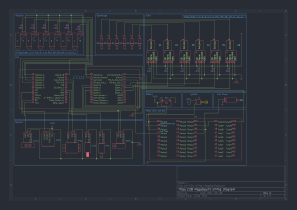
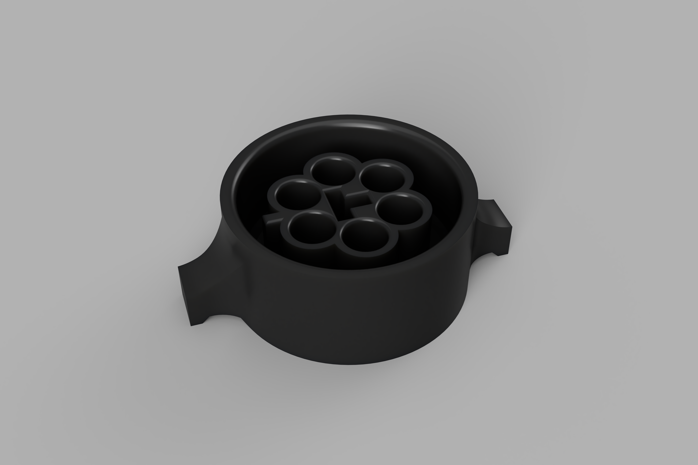

# E28-Turbo :cyclone:

To achieve a goal of 500 wheel horsepower (whp) on an E28 M30B34 engine while maintaining the stock engine block, you’ll need a combination of high-quality turbocharging components, fuel system upgrades for E85 compatibility, and careful tuning. Below is an extended breakdown of the parts and resources required.

## Table of Contents :book:
- [Fuel System](#fuel-system-fuelpump)
- [Air System](#air-system-dash)
- [Spark System](#spark-system-fire)
- [Misc](#misc-package)
- [ECU System](#ecu-system-computer)
- [Parts](#parts-hammer_and_wrench-current-total-3900)
- [3D Printed Parts](#3d-printed-parts-printer)
- [Tuning](#tuning-wrench)
- [Sources](#sources-books)

## Fuel System :fuelpump:

### Fuel Pump

I have chosen the Walbro 450lph E85 pump. There is also the AEM 340lhp E85 fuel pump as the which is capable of supporting over 500whp (plus it supports E85 fuel).

> [!NOTE]
> The Stock Fuel Pump in an E28 535i can comfortably sustain ~110lph at 43.5psi. Therefore the stock fuel pump can support ~265hp.

>[!IMPORTANT]
> Upgrading the fuel pump wiring is very important.

### Fuel Rails/ Lines

The stock fuel lines and rails (5/16ths) are capable of supporting the target power. However replacing the fuel lines with newer hoses is a good idea you can replace it with contitech insta grip 300psi hydraulic hose.

> [!Important]
> Make sure the fuel lines are rated for E85.
> Putting in a new fuel filter is a good idea.
> A surge take is not necessary for this build but it is a good idea to have one.

> [!TIP]
> 3/8ths 1/2" fuel lines are cheaper than the 5/16ths fuel lines so you might as well upgrade when replacing the 5/16ths.

### Fuel Pressure Regulator

The stock fuel pressure regulator is capable of supporting the target power. However it needs to be referenced to the manifold.

### Fuel Filter

The stock fuel filter is capable of supporting the target power.

### Injectors

The stock injectors are not capable of supporting the target power. I have chosen the siemens deka 80lb injectors as they are capable of supporting over 500whp.

> [!CAUTION]
> Avoid running the injectors at or above 80% duty cycle.

> [!TIP]
> Classic BMW injectors are 60mm long and have 14mm o-rings on both ends (60x14x14).

### Fuel Pump Wiring

The AEM or Walbro fuel pump is supposed to be fused at 20amps. Therefore the wiring system will need to be upgraded to support this. 12awg wire is recommended along with at least a 20amp relay (I will use a 35amp relay).

### Flex Fuel Sensor

The flex fuel sensor is not necessary for the build but it is a good idea to have one if you are going to run E85. The GM flex fuel sensor is a good choice.

### Fuel Mixtures

> [!TIP]
> Ethanol and Methanol are good choices for fuel mixtures.

> [!WARNING]
> Use Quality fuel.

## Air System :dash:

### Air Filter

The Air Filter I will use is the K&N 3" cone filter. This filter is capable of supporting the target power. The air filter will be placed behind the driver side fog light (as seen in dodge charger hellcat).

### Turbo

The ideal turbo size would be a 67mm turbine with a 60mm compressor (whol set H351 off a dodge cummins). The closest Borg Warner turbo is the BorgWarner Airwerks S257SX-E (7670).

> [!TIP]
> The biggest turbine housing offered on your selected turbo is the best choice.

> [!NOTE]
> The BorgWarner Airwerks S257SX-E (7670) has a max flow rate of 64lb/min and to achieve 600crank horsepower (chp) you need a flow rate of 66lb/min. Therefore the BorgWarner Airwerks S257SX-E (7670) is slightly under powered. However it is small so should spool quickly.
> You can also use the BorgWarner AirWerks S364SX-E (8780)

### Turbo Oil Feed and Return

The oil feed can be taken from the oil pressure sensor port. The oil return can be taken from the oil pan where the 7series turbo oil return is.

> [!NOTE]
> The oil return can also be placed directly into the oil pan.

### Back Pressure

A back pressure sensor is recommended. 

### Intercooler

For this build I will be using a cheap maxpeedingrods intercooler. The intercooler will be placed in front of the radiator.

### Wastegate

A Quality Wastegate is recommended. The I am using the SUM-260072 from summit racing. A good starting point for the wastegate spring is 14psi.

> [!TIP]
> The wastegate should be placed 45deg to the exhaust flow.

### Blow Off Valve

Using a blow off valve is necessary but in this build I will not be using one.

### Piping

The piping will be 3" and will be made by me.

### Intake Manifold

You can use the stock intake manifold.

### Throttle Body

The stock throttle body is capable of supporting the target power. However some modifications may be needed to add a TPS.

### MAP Sensor

The GM 3 bar MAP sensor is a good choice for this build.

### IAT Sensor

The GM Open Element Sensor is a good choice for this build.

### CLT Sensor

The stock E38/E30 Closed Element CLT is a good choice for this build however the GM CLT works too.

### TPS Sensor

The Bosh E34 TPS sensor is a good choice for this build. However I found a E32 735i TPS sensor in a junkyard so I will be using that.

E32 735i TPS Sensor Pinout:

Pin:
1, Potentiometer, reference voltage
2, Potentiometer, ground
3, Potentiometer, signal
4, Switch, idle
5, Switch, WOT
6, Switch, common ground

### Exhaust Manifold

There are premade exhaust (cast exhaust manifolds from e28 goodies) manifolds that fit the M30 engine. However I will be making my own exhaust manifold.

### Downpipe

The downpipe will be 3" and will be made by me.

### Exhaust System

The exhaust system will be 3" and will be made by me.

> [!IMPORTANT]
> The stock catalytic converter is very restrictive and should be replaced with a high flow catalytic converter (or removed if your rebellious like me).

### Boost Controller

The boost controller will be a manual boost controller. However an electronic boost controller is a good choice you can use something like the Mac boost solenoid.

### Boost Gauge

An analog boost gauge is a good choice for this build.

### AFR Gauge

The AEM Air/Fuel Ratio Gauge is a good choice for this build.

## Spark System :fire:

### Spark Plugs

NGK BPR7ES #5534 spark plugs are a good choice for this build. You can also use the NGK BPR8ES #3923 spark plugs.

> [!NOTE]
> Spark plugs should be gapped to around 0.020".

### Spark Plug Wires

LS coil wires are a good choice for this build.

### Coil Packs

LS D585 coil packs are a good choice for this build.

> [!NOTE]
> You can pull this coil packs from a chevy V8s from 1999 and up.
> The wires that are on the coil pack stock will work on this build. However the heat sleeve need to be removed.

> [!CAUTION]
> If you over dwell the coils they can fire off randomly the dwell needs to be below 3.5ms

## Misc :package:

### Head Studs

ARP Head Studs are a good choice for this build.

### Head Gasket

The stock head gasket is capable of supporting the target power. However a MLS head gasket is a good choice for this build.

> [!TIP]
> If you use the stock head gasket it can act as a fuse and blow before the head or another expensive part blows.

> [!IMPORTANT]
> Block and head should be machined flat.

### Crank Position Sensor

Hall effect sensor from diyautotune is a good choice for this build.

> [!NOTE]
> You can also use a 60-2 trigger wheel and a VR sensor mounted to the harmonic balancer.

### Motor Mounts

UHMW motor mounts are a good choice for this build.

### Lower Control Arms

E34 Lower Control Arms are a good choice for this build because they are a drop in replacement.

### Steering Box Pin

There is a steering box pin that is known to break on the e28. It is a good idea to replace it with a stronger one.

### Clutch

Sachs 765 pressure plate and a 6 puck or M5 E34 disc are a good choice for this build. Sachs 228mm 618 pressure plate and a 6 puck or M5 E34 disc are a good choice for this build.

> [!TIP]
> If you only want 350whp you can use the a clutch 6 puck 228mm disc and a 228mm pressure plate.

> [!WARNING]
> The M5 E34 clutch disc is technically not rated to 650ft/lbs of torque. However if you treat the clutch with some sympathy it should be able to handle the power.

### Transmission

The stock transmission is capable of supporting the target power. 

> [!NOTE]
> The stock transmission is a getrag 260.

> [!TIP]
> If you want a stronger transmission you can use a ZF5 310 or 320 from an E36/46

### Shifter

Condor Speed Bat or Garagistic delrin bat shift knob. hard mounting the shifter is also a good idea.

## ECU System :computer:

### ECU

The stock ECU is not capable of supporting the target power. I will be using the Megasquirt 3 ECU, specifically the MS3 Gold Lite from EFI Source.

### ECU Wiring

> [!NOTE]
> Rewiring your car is a good idea.

### ECU Tuning

The ECU will be tuned by me using TunerStudio. See [Tuning](#tuning-wrench) or the [tuning file](https://github.com/WasabiMushyPeas/E28-Turbo/tree/main/car-ECU-Tune) section for more information.

# Parts :hammer_and_wrench: (Current Total: $3,900)

## Turbo Supplies :dash:
| Name | Price  |
| --- | --- | 
| [maXpeedingrods Intercooler](https://www.amazon.com/gp/product/B09M5VYMZG/ref=as_li_tl?ie=UTF8&camp=1789&creative=9325&creativeASIN=B079WK1K1W&linkCode=as2&tag=turbineresear-20&linkId=2d7bbb943a6d435586156dc825139a8a&th=1) | $113 |
| [BorgWarner Airwerks S257SX-E (7670)](https://www.full-race.com/borgwarner-airwerks-s257sx-e-57mm-enhanced-s200sx-e-7670-turbo)| $845.52 |
| [Summit Racing](https://www.summitracing.com/parts/sum-260072?seid=srese1&gclid=CjwKCAjwxY-3BhAuEiwAu7Y6s68l7Mmk28j4K66p9dmwRYACYmAlvaX7hfwMnYjQOpiny5VPhz1K_xoC53UQAvD_BwE) | $100.99 |
| [NGR Manual Boost Controller](https://www.ebay.com/itm/176407478564?chn=ps&norover=1&mkevt=1&mkrid=711-166974-028196-7&mkcid=2&mkscid=101&itemid=176407478564&targetid=2275367127251&device=c&mktype=pla&googleloc=9191265&poi=&campaignid=21462582162&mkgroupid=166396686164&rlsatarget=pla-2275367127251&abcId=9473387&merchantid=115052582&geoid=9191265&gad_source=1&gclid=CjwKCAjwooq3BhB3EiwAYqYoElQkLnsTwCdY0Kc820Vpd9dwFAaiDH2lI_I2vTZBQjRiK2zPzITzGBoCN2wQAvD_BwE) | $59.99  |
| [K&N](https://www.knfilters.com/rg-1001rd-universal-clamp-on-air-filter) | $39.99  |

## Wiring Supplies :electric_plug:
| Name | Price |      
| --- | --- | 
| [Fuse and Relay Box](https://www.waytekwire.com/product/eaton-s-bussmann-series-15305-4-0-4-rtmr-mini-fuse) | $32.09 |
| [16-14 awg terminal female](https://www.waytekwire.com/product/aptiv-12129409-metri-pack-280-series-16-14-ga) | $7.07 |
| [14-12 awg terminal female](https://www.waytekwire.com/product/aptiv-12110845-metri-pack-280-series-14-12-ga) | $6.96 |
| [16-14 awg seals](https://www.waytekwire.com/product/aptiv-15324980-metri-pack-280) | $6.88 |
| [14-12 awg seals](https://www.waytekwire.com/product/aptiv-15324981-metri-pack-280-series-cable-seal) | $10.61  |
| [12v 35A Relay](https://www.waytekwire.com/product/picker-pc785-1c-12s-r-x-35a-280-micro-relay-74659?srsltid=AfmBOooN27f4Ldaq2lhs0xXSYbfA45JLAtFEFMKkR5VmTS2V2MxwJJ7a) | $16.473 |
| [16 awg GXL Wire (14 Colors)](https://www.wirebarn.com/6-Pack-16-Gage-GXL-Wire---------------------SIX-6-Colors-25-Foot-Each-Color---------------Red-Black-Blue-Green-Yellow-Brown-_p_15.html) | $69.94 |
| [12 awg GXL Wire (6 Colors)](https://www.wirebarn.com/6-Pack-of-12-Gage-GXL-Wire---------------------SIX-6-Colors-25-Foot-Each-Color---------------Red-Black-Blue-Green-Yellow-Brown-_p_1.html) | $62.69 |
| [60pcs Fuse Kit 2-40A](https://www.amazon.com/JOREST-30Pcs-Mini-Car-Fuse/dp/B09B3X7R24?source=ps-sl-shoppingads-lpcontext&ref_=fplfs&smid=A3HKHUWLSF6TT5&th=1) | $6.99 |
| [#8 Stud 12-10 awg Ring Terminal](https://www.waytekwire.com/catalog/terminals/ring-terminals/molex-19069-0205-ring-terminal-12-10-ga) | $12.65 |
| [Heat Shrink Kit](https://www.amazon.com/Wirefy-180-Heat-Shrink-Tubing/dp/B084GDLSCK/ref=asc_df_B084GDLSCK/?tag=hyprod-20&linkCode=df0&hvadid=693270340311&hvpos=&hvnetw=g&hvrand=5305995165868138759&hvpone=&hvptwo=&hvqmt=&hvdev=c&hvdvcmdl=&hvlocint=&hvlocphy=9191265&hvtargid=pla-900045765821&psc=1&mcid=ea15a75714eb30219f83bc9167c8b993) | $14.99  |
| [3 Way Male Connector](https://www.waytekwire.com/catalog/connectors/aptiv-metri-pack-280-series/aptiv-15300003-metri-pack-280-series-3-way) | $5.29 |
| [3 Way Female Connector](https://www.waytekwire.com/catalog/connectors/aptiv-metri-pack-280-series/aptiv-12040977-metri-pack-3-way-female-connector) | $10.71 |
| [3 Way Male TPA](https://www.waytekwire.com/catalog/connectors/aptiv-metri-pack-280-series/aptiv-15300015-metri-pack-280-series-tpa) | $5.6 |
| [3 Way Female TPA](https://www.waytekwire.com/catalog/connectors/aptiv-metri-pack-280-series/aptiv-12034145-metri-pack-280-series-tpa) | $8 |
| [14-12 awg terminal male](https://www.waytekwire.com/catalog/connectors/aptiv-metri-pack-280-series/aptiv-12129497-metri-pack-280-series-14-12-ga) | $16.56  |
| [Corrugated 0.250" 100'](https://www.waytekwire.com/catalog/wire-coverings-and-protection/corrugated-loom/corrugated-loom-lcn-250-100-split-nylon) | $20.44  |

## Sensors :thermometer:
| Name | Price  |
| --- | --- | 
| [AEM Air/Fuel Ratio Gauge](https://www.amazon.com/gp/product/B00N3VGPYS/ref=as_li_tl?ie=UTF8&camp=1789&creative=9325&creativeASIN=B00N3VGPYS&linkCode=as2&tag=turbineresear-20&linkId=0f8aafe35cbc76ee3b5ca863b6cf572a&th=1) | $184.95 |
| [GM 3 bar MAP sensor](https://www.diyautotune.com/product/gm-3-bar-map-sensor/) | $89.99 |
| [GM Open Element Sensor](https://www.amazon.com/Intake-Temperature-Repl-OE-25036751-25037225/dp/B07THSTNN9) | $16.99  |
| [GM Closed Element CLT](https://www.diyautotune.com/product/gm-closed-element-clt-iat-sensor/) | $23.99 |
| [Bosh TPS Sensor](https://www.ebay.com/itm/305035638163) | $50 |
| [GM Flex Fuel Sensor](https://www.amazon.com/ACDelco-13577379-Original-Equipment-Sensor/dp/B01GQR9ETI) + [Pigtail](https://www.amazon.com/Connector-Pigtail-Plastic-Composition-Ethanol/dp/B07115TSNK/ref=pd_bxgy_d_sccl_1/147-4181421-9837242?pd_rd_w=91Egl&content-id=amzn1.sym.f7fa8b58-6436-47b8-8741-9e90c231669e&pf_rd_p=f7fa8b58-6436-47b8-8741-9e90c231669e&pf_rd_r=JKJY1985SPHVHDNZY8QE&pd_rd_wg=9QX1S&pd_rd_r=37bca7b8-a9e5-4443-a583-21a26f041f9d&pd_rd_i=B07115TSNK&psc=1) | $102.42 |

## Misc :package:
| Name  | price  |
| --- | --- | 
| [80lb Siemens Deka](https://www.ebay.com/itm/204962182070?chn=ps&_trkparms=ispr%3D1&amdata=enc%3A12CO26Z_gSoS5RIsUfStKcA22&norover=1&mkevt=1&mkrid=711-117182-37290-0&mkcid=2&mkscid=101&itemid=204962182070&targetid=2374270860207&device=c&mktype=pla&googleloc=9032016&poi=&campaignid=21214301188&mkgroupid=161029916821&rlsatarget=pla-2374270860207&abcId=9407524&merchantid=5326329245&gad_source=1&gclid=CjwKCAjwxY-3BhAuEiwAu7Y6s9YfhyVqujowXrsGmcFyPHqTs2q8KSkARbqqndQRYko8RpruyCGGVxoCFJEQAvD_BwE) | $149.98 |
| [ARP Head Studs](https://www.amazon.com/ARP-201-4602-Head-Stud-Kit/dp/B002ENQGVS) | $216.99 |
| [LS ENA coils](https://amzn.to/3rr1SGq) | $116.99 |
| [Walbro 450lph](https://www.summitracing.com/parts/vpn-f90000274?seid=srese1&ppckw=pmax-stock-replacement&gclid=Cj0KCQjw3vO3BhCqARIsAEWblcBFkoitlQ8aPTN59R1y90lb2coq3u4Qnj707qFZB56t0oLiGIZePgAaAm_MEALw_wcB) | $110.99 |
| [Ring Light](https://www.amazon.com/Qasim-White-Circle-Headlight-Plastic/dp/B078Y6MFNB/ref=sr_1_4?dib=eyJ2IjoiMSJ9.WRGZjMj_BdoU9jDn0RiniXzWEf2PVnVt_smCLPuT77YvLiijE3fjSANHNz8y6KE9lWc0aql5NqQvQ0XbWxRgRuYmGbSzKKwRc352soSNczF_8fe8e3Xe2hAAG5XIXo7pHEY_eL33a9vttrRAUKkkUs4ePhZVVOyeheyBOBOneyF3FYYQdNExTe0QiHCbeatVE-g0DbtjuJJZFIis-R5hode9wj0eEJqF__K51Cdf9hVOh9ltJR1WIbEOrvD1_FQk-kN79SA20IHLdn2I91b7gX3YRFryysLiqWoR1Uk4fDQ.dm0hZ5OOuytYzyAklIXmKaRfMCuKQq7qDWuO5M6VyUQ&dib_tag=se&keywords=halo%2Blights%2Bfor%2Bcars&qid=1726275057&sr=8-4&th=1) | $11.99 |
| [Sachs 765 Pressure Plate](https://www.speedingparts.com/p/powertrain/clutch-flywheel/pressure-plate/sachs-765-bmw-m5-e34.html) | $431.45 |
| [E34 Clutch plate](https://www.fcpeuro.com/products/bmw-clutch-friction-disc-m6-m5-1861931034?ads_cmpid=21615270671&ads_adid=165716343825&ads_matchtype=&ads_network=g&ads_creative=710409756405&utm_term=&ads_targetid=pla-297546631617&utm_campaign=&utm_source=adwords&utm_medium=ppc&ttv=2&gad_source=1&gclid=CjwKCAjwgfm3BhBeEiwAFfxrG8yLdu-8YCRsgCZvPU_45RODMutYOuFYQO-KpR1oZGBv4RyBsHTohhoCLTsQAvD_BwE) | $155.99 |

# 3D Printed Parts :printer:

### E32 735i TPS Wiring Connector

The E32 735i TPS Wiring Bracket is a cap that acts a male connector for the TPS sensor. The bracket is 3D printed and is a good choice for this build. See the [3D Printed Parts](https://github.com/WasabiMushyPeas/E28-Turbo/tree/main/3D-printed-parts) for the files.

# Tuning :wrench:

## Boost

## Fuel

> [!WARNING]
> Error on the rich side to keep the engine safe.

## Timing

> [!WARNING]
> Try to aim for the least amount of timing that the engine can handle.

## Idle

## Rev Limiter

- The revs will be limited by controlling the fuel and spark. The rev hard limiter will be set to 6,200rpm.

- The soft rev limiter will be set to 275 ie 5,925rpm.

- The engine redlines at 6,200rpm however the turbo should be spooled by 4,000rpm. Therefore the turbo should be spooled by 4,000rpm and the engine should be making full power by 5,500rpm. so the redline can be set to 6,200rpm.

> [!NOTE]
> Coolant Rev Limiter is a good idea. (220F is a good temperature limit)
> Fuel cutting is the softest rev limiter (used in OEM cars).

> [!IMPORTANT]
> Spark cut makes flames and bangs (For more flames give more timing retard).

> [!WARNING]
> Attempting to keep torque low at low RPMs (under 4500rpm) is a good idea. 

## Misc

> [!TIP]
> Try to setup all the safety features in the ECU.

## Sources :books:

- [Turbo My Car Sheets](https://docs.google.com/spreadsheets/d/1L-gm92k8GjX_CAtG5Tr8l-kkGmf6Y0_LVqK74C0jl5A/edit?usp=sharing)
- [Tips For Turbo Doc](https://docs.google.com/document/d/1tCY4XEPRH73pGDfh2RHCs6wGMogO4zm7vlCZIpCkT3s/edit?usp=sharing)
- [E28 Turbine Research](https://youtube.com/playlist?list=PLMjPIiNtOwgkLDpK1UCV_LkQOiv-6YodZ&si=10aHMjlBm92FTnhA)
- [Rewire Your Car](https://www.youtube.com/watch?v=pSXv8RHa22I)
- [Megasquirt Basics](https://youtu.be/6LTwtQDOoRA?si=BNSUtUBE0bgF90Mo)
- [Tune Megasquirt](https://youtu.be/9ALDDK5u5Q8?si=wl1CMeRQ-DNlSQ2k)
- [Turbo an E28 MyE28](https://www.mye28.com/viewtopic.php?t=50038)

[Back to top](#e28-turbo-cyclone)