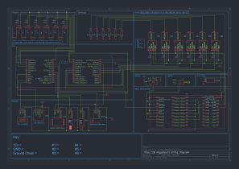

# E28-Turbo :cyclone:

# Info :information_source:
- What I know
- What needs to be done
- Tips
(if any of the sections are empty there is most likely information on it in one of the sources)

## Fuel System :fuelpump:

### Fuel Pump

The Stock Fuel Pump in an E28 535i can comfortably sustain ~110lph at 43.5psi. Therefore the stock fuel pump can support ~265hp. In this build our target is about 500whp. To achieve this we will need to upgrade the fuel pump. I have chosen the Walbro 450lph E85 pump. There is also the AEM 340lhp E85 fuel pump as the which is capable of supporting over 500whp (plus it supports E85 fuel).

### Fuel Rails/ Lines

The stock fuel lines and rails (5/16ths) are capable of supporting the target power. However replacing the fuel lines with newer hoses is a good idea you can replace it with contitech insta grip.

### Fuel Pressure Regulator

The stock fuel pressure regulator is capable of supporting the target power. However it needs to be referenced to the manifold.

### Fuel Filter

The stock fuel filter is capable of supporting the target power.

### Injectors

The stock injectors are not capable of supporting the target power. I have chosen the siemens deka 80lb injectors as they are capable of supporting over 500whp.

### Fuel Pump Wiring

The AEM or Walbro fuel pump is supposed to be fused at 20amps. Therefore the wiring system will need to be upgraded to support this. 12awg wire is recommended along with at least a 20amp relay (I will use a 35amp relay).

### Flex Fuel Sensor

The flex fuel sensor is not necessary for the build but it is a good idea to have one if you are going to run E85. The GM flex fuel sensor is a good choice.

### Fuel Mixtures

## Air System :dash:

### Air Filter

The Air Filter I will use is the K&N 3" cone filter. This filter is capable of supporting the target power. The air filter will be placed behind the driver side fog light (as seen in dodge charger hellcat).

### Turbo

The ideal turbo size would be a 67mm turbine with a 60mm compressor (whol set H351 off a dodge cummins). The closest Borg Warner turbo is the BorgWarner Airwerks S257SX-E (7670)

### Turbo Oil Feed and Return

The oil feed can be taken from the oil pressure sensor port. The oil return can be taken from the oil pan where the 7series turbo oil return is.

### Back Pressure

A back pressure sensor is recommended. 

### Intercooler

For this build I will be using a cheap maxpeedingrods intercooler. The intercooler will be placed in front of the radiator.

### Wastegate

A Quality Wastegate is recommended. The I am using the SUM-260072 from summit racing. A good starting point for the wastegate spring is 14psi.

### Blow Off Valve

Using a blow off valve is necessary but in this build I will not be using one.

### Piping

The piping will be 3" and will be made by me.

### Intake Manifold

You can use the stock intake manifold.

### Throttle Body

The stock throttle body is capable of supporting the target power. However some modifications may be needed to add a TPS.

### MAP Sensor

The GM 3 bar MAP sensor is a good choice for this build.

### IAT Sensor

The GM Open Element Sensor is a good choice for this build.

### TPS Sensor

The Bosh E34 TPS sensor is a good choice for this build.

### Exhaust Manifold

There are premade exhaust (cast exhaust manifolds from e28 goodies) manifolds that fit the M30 engine. However I will be making my own exhaust manifold.

### Downpipe

The downpipe will be 3" and will be made by me.

### Exhaust System

The exhaust system will be 3" and will be made by me.

### Boost Controller

The boost controller will be a manual boost controller. However an electronic boost controller is a good choice you can use something like the Mac boost solenoid.

### Boost Gauge

An analog boost gauge is a good choice for this build.

### AFR Gauge

The AEM Air/Fuel Ratio Gauge is a good choice for this build.

## Spark System :fire:

### Spark Plugs

Unknown

### Spark Plug Wires

LS coil wires are a good choice for this build.

### Coil Packs

LS D585 coil packs are a good choice for this build.

> [!WARNING]  
> If you over dwell the coils they can fire off randomly the dwell needs to be below 3.5ms

## Misc :package:

### Head Studs

ARP Head Studs are a good choice for this build.

### Crank Position Sensor

Hall effect sensor from diyautotune is a good choice for this build.

### Motor Mounts

UHMW motor mounts are a good choice for this build.

### Lower Control Arms

E34 Lower Control Arms are a good choice for this build because they are a drop in replacement.

### Steering Box Pin

There is a steering box pin that is known to break on the e28. It is a good idea to replace it with a stronger one.

### Clutch

Sachs 765 pressure plate and a 6 puck or M5 E34 disc are a good choice for this build. (Condor Speed Bat or Garagistic delrin bat shift knob. hard mounting the shifter is a good idea)

## ECU System :computer:

### ECU

The stock ECU is not capable of supporting the target power. I will be using the Megasquirt 3 ECU, specifically the MS3 Gold Lite from EFI Source.

### ECU Wiring

### ECU Tuning

The ECU will be tuned by me using TunerStudio. See the [Tuning](https://github.com/WasabiMushyPeas/E28-Turbo/tree/main/car-ECU-Tune) or the [tuning file]() section for more information.

### ECU Sensors

Some sensors that have not been mentioned in the other sections are the CLT Crank Position Sensor. The GM Closed Element CLT is a good choice for this build however the stock E38/E30 CLT works too. 

# Parts :hammer_and_wrench: (Current Total: $3,300)

## Turbo Supplies :dash:
| Name | Price  |
| --- | --- | 
| [maXpeedingrods Intercooler](https://www.amazon.com/gp/product/B09M5VYMZG/ref=as_li_tl?ie=UTF8&camp=1789&creative=9325&creativeASIN=B079WK1K1W&linkCode=as2&tag=turbineresear-20&linkId=2d7bbb943a6d435586156dc825139a8a&th=1) | $113 |
| [BorgWarner Airwerks S257SX-E (7670)](https://www.full-race.com/borgwarner-airwerks-s257sx-e-57mm-enhanced-s200sx-e-7670-turbo)| $845.52 |
| [Summit Racing](https://www.summitracing.com/parts/sum-260072?seid=srese1&gclid=CjwKCAjwxY-3BhAuEiwAu7Y6s68l7Mmk28j4K66p9dmwRYACYmAlvaX7hfwMnYjQOpiny5VPhz1K_xoC53UQAvD_BwE) | $100.99 |
| [NGR Manual Boost Controller](https://www.ebay.com/itm/176407478564?chn=ps&norover=1&mkevt=1&mkrid=711-166974-028196-7&mkcid=2&mkscid=101&itemid=176407478564&targetid=2275367127251&device=c&mktype=pla&googleloc=9191265&poi=&campaignid=21462582162&mkgroupid=166396686164&rlsatarget=pla-2275367127251&abcId=9473387&merchantid=115052582&geoid=9191265&gad_source=1&gclid=CjwKCAjwooq3BhB3EiwAYqYoElQkLnsTwCdY0Kc820Vpd9dwFAaiDH2lI_I2vTZBQjRiK2zPzITzGBoCN2wQAvD_BwE) | $59.99  |
| [K&N](https://www.knfilters.com/rg-1001rd-universal-clamp-on-air-filter) | $39.99  |

## Wiring Supplies :electric_plug:
| Name | Price |      
| --- | --- | 
| [Fuse and Relay Box](https://www.waytekwire.com/product/eaton-s-bussmann-series-15305-4-0-4-rtmr-mini-fuse) | $32.09 |
| [16-14 awg terminal female](https://www.waytekwire.com/product/aptiv-12129409-metri-pack-280-series-16-14-ga) | $7.07 |
| [14-12 awg terminal female](https://www.waytekwire.com/product/aptiv-12110845-metri-pack-280-series-14-12-ga) | $6.96 |
| [16-14 awg seals](https://www.waytekwire.com/product/aptiv-15324980-metri-pack-280) | $6.88 |
| [14-12 awg seals](https://www.waytekwire.com/product/aptiv-15324981-metri-pack-280-series-cable-seal) | $10.61  |
| [12v 35A Relay](https://www.waytekwire.com/product/picker-pc785-1c-12s-r-x-35a-280-micro-relay-74659?srsltid=AfmBOooN27f4Ldaq2lhs0xXSYbfA45JLAtFEFMKkR5VmTS2V2MxwJJ7a) | $16.473 |
| [16 awg GXL Wire (14 Colors)](https://www.wirebarn.com/6-Pack-16-Gage-GXL-Wire---------------------SIX-6-Colors-25-Foot-Each-Color---------------Red-Black-Blue-Green-Yellow-Brown-_p_15.html) | $69.94 |
| [12 awg GXL Wire (6 Colors)](https://www.wirebarn.com/6-Pack-of-12-Gage-GXL-Wire---------------------SIX-6-Colors-25-Foot-Each-Color---------------Red-Black-Blue-Green-Yellow-Brown-_p_1.html) | $62.69 |
| [60pcs Fuse Kit 2-40A](https://www.amazon.com/JOREST-30Pcs-Mini-Car-Fuse/dp/B09B3X7R24?source=ps-sl-shoppingads-lpcontext&ref_=fplfs&smid=A3HKHUWLSF6TT5&th=1) | $6.99 |
| [#8 Stud 12-10 awg Ring Terminal](https://www.waytekwire.com/catalog/terminals/ring-terminals/molex-19069-0205-ring-terminal-12-10-ga) | $12.65 |
| [Heat Shrink Kit](https://www.amazon.com/Wirefy-180-Heat-Shrink-Tubing/dp/B084GDLSCK/ref=asc_df_B084GDLSCK/?tag=hyprod-20&linkCode=df0&hvadid=693270340311&hvpos=&hvnetw=g&hvrand=5305995165868138759&hvpone=&hvptwo=&hvqmt=&hvdev=c&hvdvcmdl=&hvlocint=&hvlocphy=9191265&hvtargid=pla-900045765821&psc=1&mcid=ea15a75714eb30219f83bc9167c8b993) | $14.99  |
| [3 Way Male Connector](https://www.waytekwire.com/catalog/connectors/aptiv-metri-pack-280-series/aptiv-15300003-metri-pack-280-series-3-way) | $5.29 |
| [3 Way Female Connector](https://www.waytekwire.com/catalog/connectors/aptiv-metri-pack-280-series/aptiv-12040977-metri-pack-3-way-female-connector) | $10.71 |
| [3 Way Male TPA](https://www.waytekwire.com/catalog/connectors/aptiv-metri-pack-280-series/aptiv-15300015-metri-pack-280-series-tpa) | $5.6 |
| [3 Way Female TPA](https://www.waytekwire.com/catalog/connectors/aptiv-metri-pack-280-series/aptiv-12034145-metri-pack-280-series-tpa) | $8 |
| [14-12 awg terminal male](https://www.waytekwire.com/catalog/connectors/aptiv-metri-pack-280-series/aptiv-12129497-metri-pack-280-series-14-12-ga) | $16.56  |
| [Corrugated 0.250" 100'](https://www.waytekwire.com/catalog/wire-coverings-and-protection/corrugated-loom/corrugated-loom-lcn-250-100-split-nylon) | $20.44  |

## Sensors :thermometer:
| Name | Price  |
| --- | --- | 
| [AEM Air/Fuel Ratio Gauge](https://www.amazon.com/gp/product/B00N3VGPYS/ref=as_li_tl?ie=UTF8&camp=1789&creative=9325&creativeASIN=B00N3VGPYS&linkCode=as2&tag=turbineresear-20&linkId=0f8aafe35cbc76ee3b5ca863b6cf572a&th=1) | $184.95 |
| [GM 3 bar MAP sensor](https://www.diyautotune.com/product/gm-3-bar-map-sensor/) | $89.99 |
| [GM Open Element Sensor](https://www.amazon.com/Intake-Temperature-Repl-OE-25036751-25037225/dp/B07THSTNN9) | $16.99  |
| [GM Closed Element CLT](https://www.diyautotune.com/product/gm-closed-element-clt-iat-sensor/) | $23.99 |
| [Bosh TPS Sensor](https://www.ebay.com/itm/305035638163) | $50 |
| [GM Flex Fuel Sensor](https://www.amazon.com/ACDelco-13577379-Original-Equipment-Sensor/dp/B01GQR9ETI) + [Pigtail](https://www.amazon.com/Connector-Pigtail-Plastic-Composition-Ethanol/dp/B07115TSNK/ref=pd_bxgy_d_sccl_1/147-4181421-9837242?pd_rd_w=91Egl&content-id=amzn1.sym.f7fa8b58-6436-47b8-8741-9e90c231669e&pf_rd_p=f7fa8b58-6436-47b8-8741-9e90c231669e&pf_rd_r=JKJY1985SPHVHDNZY8QE&pd_rd_wg=9QX1S&pd_rd_r=37bca7b8-a9e5-4443-a583-21a26f041f9d&pd_rd_i=B07115TSNK&psc=1) | $102.42 |

## Misc :package:
| Name  | price  |
| --- | --- | 
| [80lb Siemens Deka](https://www.ebay.com/itm/204962182070?chn=ps&_trkparms=ispr%3D1&amdata=enc%3A12CO26Z_gSoS5RIsUfStKcA22&norover=1&mkevt=1&mkrid=711-117182-37290-0&mkcid=2&mkscid=101&itemid=204962182070&targetid=2374270860207&device=c&mktype=pla&googleloc=9032016&poi=&campaignid=21214301188&mkgroupid=161029916821&rlsatarget=pla-2374270860207&abcId=9407524&merchantid=5326329245&gad_source=1&gclid=CjwKCAjwxY-3BhAuEiwAu7Y6s9YfhyVqujowXrsGmcFyPHqTs2q8KSkARbqqndQRYko8RpruyCGGVxoCFJEQAvD_BwE) | $149.98 |
| [ARP Head Studs](https://www.amazon.com/ARP-201-4602-Head-Stud-Kit/dp/B002ENQGVS) | $216.99 |
| [LS ENA coils](https://amzn.to/3rr1SGq) | $116.99 |
| [AEM 340LPH E85](https://www.amazon.com/gp/product/B016MWXRK4/ref=as_li_tl?ie=UTF8&camp=1789&creative=9325&creativeASIN=B016MWXRK4&linkCode=as2&tag=turbineresear-20&linkId=c629e118a608dcf17e5da6b49dc90a0a) | $130.64 |
| [Ring Light](https://www.amazon.com/Qasim-White-Circle-Headlight-Plastic/dp/B078Y6MFNB/ref=sr_1_4?dib=eyJ2IjoiMSJ9.WRGZjMj_BdoU9jDn0RiniXzWEf2PVnVt_smCLPuT77YvLiijE3fjSANHNz8y6KE9lWc0aql5NqQvQ0XbWxRgRuYmGbSzKKwRc352soSNczF_8fe8e3Xe2hAAG5XIXo7pHEY_eL33a9vttrRAUKkkUs4ePhZVVOyeheyBOBOneyF3FYYQdNExTe0QiHCbeatVE-g0DbtjuJJZFIis-R5hode9wj0eEJqF__K51Cdf9hVOh9ltJR1WIbEOrvD1_FQk-kN79SA20IHLdn2I91b7gX3YRFryysLiqWoR1Uk4fDQ.dm0hZ5OOuytYzyAklIXmKaRfMCuKQq7qDWuO5M6VyUQ&dib_tag=se&keywords=halo%2Blights%2Bfor%2Bcars&qid=1726275057&sr=8-4&th=1) | $11.99 |

## Sources :books:

- [Turbo my car Sheets](https://docs.google.com/spreadsheets/d/1L-gm92k8GjX_CAtG5Tr8l-kkGmf6Y0_LVqK74C0jl5A/edit?usp=sharing)
- [Tips For Turbo Doc](https://docs.google.com/document/d/1tCY4XEPRH73pGDfh2RHCs6wGMogO4zm7vlCZIpCkT3s/edit?usp=sharing)
- [e28 turbine research](https://youtube.com/playlist?list=PLMjPIiNtOwgkLDpK1UCV_LkQOiv-6YodZ&si=10aHMjlBm92FTnhA)
- [rewire your car](https://www.youtube.com/watch?v=pSXv8RHa22I)
- [megasquirt basics](https://youtu.be/6LTwtQDOoRA?si=BNSUtUBE0bgF90Mo)
- [tune megasquirt](https://youtu.be/9ALDDK5u5Q8?si=wl1CMeRQ-DNlSQ2k)
- [turbo an e28 myE28](https://www.mye28.com/viewtopic.php?t=50038)

# Tuning :wrench:

## Boost

## Fuel

## Timing

## Idle

## Misc

- The engine redlines at 6,500rpm however the turbo should be spooled by 4,000rpm. Therefore the turbo should be spooled by 4,000rpm and the engine should be making full power by 5,500rpm. so the redline can be set to 6,000rpm.
